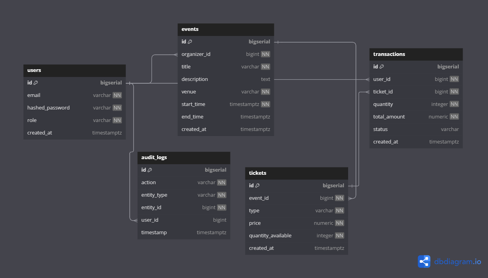

<!-- PROJECT LOGO -->
<br />
div align="center">
  <h3 align="center">Event Ticketing System</h3>
  <h5 align="center">
    <br />
    <a href="https://event-ticket.me/" target="_blank">View Live</a>
    |
    <a href="https://github.com/nickemma/event-ticketing-system/issues/new" target="_blank">Report Bug</a>
    |
    <a href="https://github.com/nickemma/event-ticketing-system/issues/new" target="_blank">Request Feature</a>
  </h5>

<!-- ABOUT THE PROJECT -->

### Event Ticketing System

A scalable backend service for managing events, tickets, and transactions. Built with Golang, PostgreSQL, and Kubernetes  on the backend, and a modern Next.js frontend for a seamless user experience. Features include JWT authentication, atomic ticket inventory management, payment processing, and audit logging.

<div align="center">
  
</div>

#### Built With

**Backend & DevOps:**

[](https://go.dev/)
[](https://gin-gonic.com/)
[](https://grpc.io/)
[](https://www.postgresql.org/)
[](https://redis.io/)
[](https://www.docker.com/)
[](https://aws.amazon.com/)
[](https://kubernetes.io/)
[](https://github.com/features/actions)

**Frontend & UI/UX:**

[](https://nextjs.org/)
[](https://react.dev/)
[](https://www.typescriptlang.org/)
[](https://tailwindcss.com/)
[](https://zustand-demo.pmnd.rs/)
[](https://tanstack.com/query/latest)
[](https://axios-http.com/)  
[](https://ui.shadcn.com/)

<p align="right">(<a href="#readme-top">back to top</a>)</p>

---

<!-- GETTING STARTED -->

### Getting Started

#### Prerequisites

**Backend**:
- Go 1.21+
- Docker & Docker Compose
- PostgreSQL 15
- Redis 7

**Frontend**:
- Node.js 20+
- npm/yarn

#### Installation

1. **Clone the repository**
   ```sh
   git clone https://github.com/nickemma/event-ticketing-system.git
   cd event-ticketing-system

2. **Set up environment variables**
   ```sh
   cp .env.example .env

3. **Start dependencies**
   ```sh
   docker-compose up -d postgres redis

4. **Run database migrations**
   ```sh
   make migrateup

5. **Start the server**
   ```sh
   make server
   
6. **Access the App**
- Frontend: http://localhost:3000
- Backend API: http://localhost:8080

<p align="right">(<a href="#readme-top">back to top</a>)</p>

<!-- FRONTEND FEATURES -->
### Frontend Features
1. User Authentication
 - Login/register with JWT token management.
 - Protected routes for organizers.
2. Event Dashboard
- Create/edit events (organizers).
- Browse events with filters (users).
3. Ticket Purchase Flow
- Real-time inventory updates during checkout.
- Payment simulation with Stripe.js.
4. Responsive Design
- Mobile-first UI built with Tailwind CSS.

<!-- CONTRIBUTING -->

### Contributing

Contributions are what make the open source community such an amazing place to learn, inspire, and create. Any contributions you make are **greatly appreciated**.

If you have a suggestion that would make this better, please fork the repo and create a pull request. You can also simply open an issue with the tag "enhancement".
Don't forget to give the project a star! Thanks again!

1. Fork the Project
2. Create your Feature Branch (`git checkout -b feature/your-feature`)
3. Commit your Changes (`git commit -m 'Add some Amazing Feature'`)
4. Push to the Branch (`git push origin feature/your-feature`)
5. Open a Pull Request

Areas to Contribute:

- Improve UI/UX with animations and better styling
- Add dark mode support
- Implement more advanced authentication features
- Integrate real-time ticket availability tracking
- Add payment gateway integrations (Stripe/PayPal)
- Improve concurrent ticket purchase handling
- Enhance Kubernetes deployment manifests

<p align="right">(<a href="#readme-top">back to top</a>)</p>

---

<!-- LICENSE -->

### License

Distributed under the Apache2.0 License. See [Apache License 2.0](LICENSE) for details.

<p align="right">(<a href="#readme-top">back to top</a>)</p>

---

<!-- CONTACT -->

### Contact

#### Nicholas Emmanuel

 <div align="center">
 <a href="https://www.linkedin.com/in/techieemma/"></a> 
 <a href="https://twitter.com/techieEmma"></a> 
 <a href="https://github.com/nickemma/"></a>
 <a href="mailto:nicholasemmanuel321@gmail.com"></a>
 </div>

<p align="right">(<a href="#readme-top">back to top</a>)</p>

---

<!-- ACKNOWLEDGMENTS -->

## Acknowledgments
- Inspired by [Tech School](https://github.com/techschool) for Golang backend patterns
- [Gin Web Framework](https://gin-gonic.com/) for REST API development
- [](https://sqlc.dev/) for type-safe SQL queries
- [Dribbble](https://dribbble.com/) for the UI design inspiration for this project.

<p align="right">(<a href="#readme-top">back to top</a>)</p>